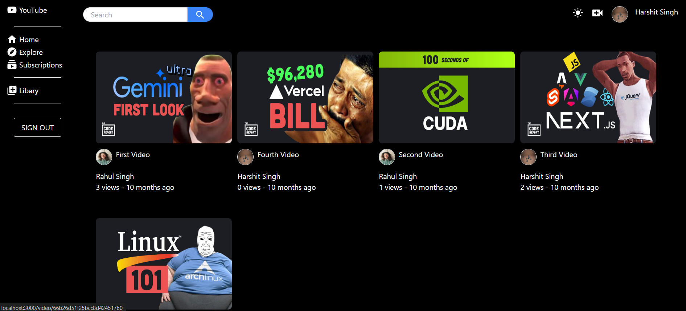

# YouTube Clone

A full-stack YouTube clone application built with React, Node.js, and MongoDB. This project replicates core YouTube features with a modern UI and robust backend architecture.

# YouTube Clone

A full-stack YouTube clone application built with React, Node.js, and MongoDB. This project replicates core YouTube features with a modern UI and robust backend architecture.

## 📸 Screenshots

### Home Page

*Main page with video recommendations and trending content*

### Video Player

*Video playback page with comments and related videos*

### User Profile

*User profile page with uploaded videos and channel information*

### Dark Mode

*Application in dark mode for better night viewing*

### Search Results

*Search functionality with filtered results*

// ... existing code ...

## 🚀 Features

### User Features
- User authentication (Sign up, Login, Logout)
- User profile management
- Video upload and management
- Video playback
- Like/Dislike videos
- Comment on videos
- Subscribe to channels
- Save videos to library
- Watch history
- Search functionality
- Dark/Light mode

### Video Features
- Video streaming
- Video categorization
- Trending videos
- Random video suggestions
- Video recommendations
- Video tags
- View count
- Video duration

## 🛠️ Tech Stack

### Frontend
- React 18
- TypeScript
- Redux Toolkit (State Management)
- Material-UI
- TailwindCSS
- Axios
- React Router
- React Player

### Backend
- Node.js
- Express.js
- MongoDB
- Mongoose
- JWT Authentication
- Cloudinary (Video/Image Storage)
- Multer (File Upload)

## 📦 Project Structure

```
├── client-react/          # Frontend React application
│   ├── src/
│   │   ├── components/    # Reusable components
│   │   ├── pages/        # Page components
│   │   ├── store/        # Redux store
│   │   ├── models/       # TypeScript interfaces
│   │   └── URL/          # API endpoints
│   └── package.json
│
├── server-side/          # Backend Node.js application
│   ├── src/
│   │   ├── controllers/  # Route controllers
│   │   ├── models/       # Database models
│   │   ├── routes/       # API routes
│   │   ├── middlewares/  # Custom middlewares
│   │   └── utils/        # Utility functions
│   └── package.json
```

## 🚀 Getting Started

### Prerequisites
- Node.js (v14 or higher)
- MongoDB
- npm or yarn

### Installation

1. Clone the repository
```bash
git clone https://github.com/yourusername/youtube-clone.git
cd youtube-clone
```

2. Install Frontend Dependencies
```bash
cd client-react
npm install
```

3. Install Backend Dependencies
```bash
cd ../server-side
npm install
```

4. Environment Setup

Create a `.env` file in the server-side directory:
```env
MONGODB_URL=your_mongodb_url
PORT=8080
ACCESS_TOKEN_SECRET=your_access_token_secret
ACCESS_TOKEN_EXPIRY=1d
REFRESH_TOKEN_SECRET=your_refresh_token_secret
REFRESH_TOKEN_EXPIRY=40d
CLOUDINARY_CLOUD_NAME=your_cloudinary_cloud_name
CLOUDINARY_API_KEY=your_cloudinary_api_key
CLOUDINARY_API_SECRET=your_cloudinary_api_secret
```

### Running the Application

1. Start the Backend Server
```bash
cd server-side
npm run dev
```

2. Start the Frontend Development Server
```bash
cd client-react
npm start
```

The application will be available at:
- Frontend: http://localhost:3000
- Backend: http://localhost:8080

## 🔒 API Endpoints

### Authentication
- POST /api/v1/users/register - Register new user
- POST /api/v1/users/login - User login
- POST /api/v1/users/logout - User logout
- POST /api/v1/users/refresh-Token - Refresh access token

### User
- GET /api/v1/users/find/:id - Get user by ID
- PATCH /api/v1/users/update-account - Update user account
- DELETE /api/v1/users/delete-user - Delete user account

### Video
- POST /api/v1/videos - Upload video
- GET /api/v1/videos/find/:id - Get video by ID
- PUT /api/v1/videos/:id - Update video
- DELETE /api/v1/videos/:id - Delete video
- GET /api/v1/videos/random - Get random videos
- GET /api/v1/videos/trend - Get trending videos
- GET /api/v1/videos/search - Search videos

### Comments
- POST /api/v1/comments - Add comment
- DELETE /api/v1/comments/:id - Delete comment
- GET /api/v1/comments/:videoId - Get video comments

## 🔐 Security Features

- JWT Authentication
- Password Hashing
- Protected Routes
- Secure File Upload
- Input Validation
- Error Handling
- CORS Configuration

## 🎨 UI Features

- Responsive Design
- Dark/Light Mode
- Modern Material-UI Components
- Clean and Intuitive Navigation
- Loading States
- Error Handling
- Form Validation

## 🚧 Ongoing Development

### Current Work
- Implementing video quality selection
- Adding video chapters and timestamps
- Enhancing search functionality with filters
- Improving video recommendations algorithm
- Adding user notifications system
- Implementing video analytics
- Adding support for multiple languages

### Planned Features
- Live streaming capability
- Community posts and discussions
- Video playlists management
- Advanced video editing tools
- Channel monetization features
- Video download options
- Enhanced comment system with replies
- User dashboard with analytics
- Mobile app development
- Integration with social media platforms

### Performance Improvements
- Implementing video caching
- Optimizing database queries
- Adding CDN support
- Implementing lazy loading
- Enhancing error handling
- Improving API response times
- Adding request rate limiting
- Implementing better state management

### Security Enhancements
- Adding two-factor authentication
- Implementing OAuth2.0
- Enhancing password policies
- Adding IP-based security
- Implementing better session management
- Adding audit logging
- Enhancing data encryption

## 🤝 Contributing

1. Fork the repository
2. Create your feature branch (`git checkout -b feature/AmazingFeature`)
3. Commit your changes (`git commit -m 'Add some AmazingFeature'`)
4. Push to the branch (`git push origin feature/AmazingF
